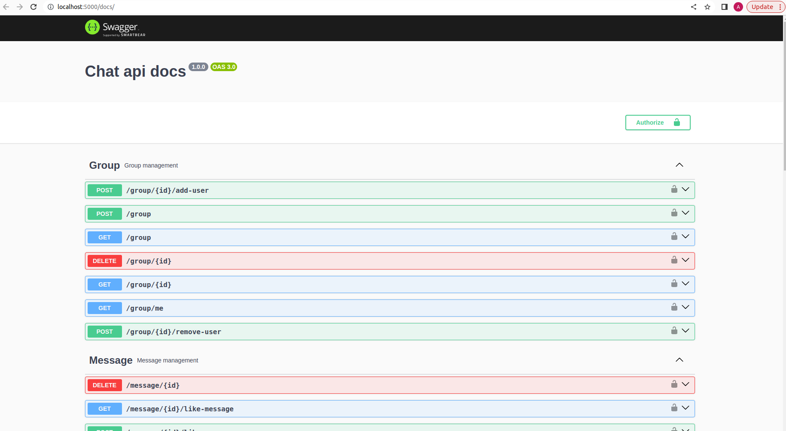

# Chat Api Application


## Run the project
 `git clone https://github.com/ojhakash/chat-api-application`
### With docker-compose
 - `docker-compose build`
 - `docker-compose up`

### With npm
 - Create and add the following details to .env file
    ```plaintext
    NODE_ENV=development 
    PORT=5000
    DB_NAME=test
    DB_USER=user
    DB_PASSWORD=password
    DB_HOST=127.0.0.1
    DB_PORT=5432
    DB_DIALECT=postgres
    JWT_SECRET='sshdjcflydktrjz8768756gcg'
    ```
   Reconfigure the database configuration as per your requirement
 - `npm install`
 - `npm run dev`

## Test the project
 - Create and add the following details to .env.test file
    ```plaintext
    NODE_ENV=test 
    PORT=5000
    DB_NAME=my_test
    DB_USER=user
    DB_PASSWORD=password
    DB_HOST=127.0.0.1
    DB_PORT=5432
    DB_DIALECT=postgres
    JWT_SECRET='sshdjcflydktrjz8768756gcg'
    ```
    npm run test

Your app will be running on http://localhost:5000/

You can download Json for postman from - http://localhost:5000/docs.json

To see the api-documentation please open - http://localhost:5000/docs


